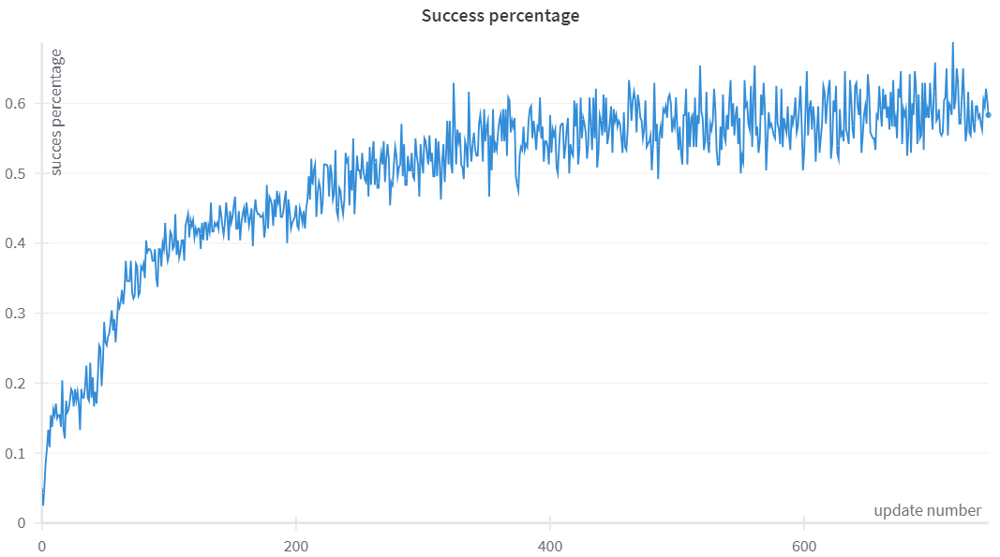

## MAML for RL in pytorch

This repository contains implementations of Model Agnostic Meta Learning ([Finn. 2017](https://arxiv.org/abs/1703.03400)) in pytorch.
They are meant to be easy to understand and contain a good amount of comments.

The MAML_simple folder contains a simple implementation with a version using standard [pytorch](https://pytorch.org/) and another version that also uses [torchopt](https://torchopt.readthedocs.io/en/latest/). It is showcased for a simple [minigrid](https://minigrid.farama.org/index.html) environment.

The FO-MAML folder contains an implementation of the first order version of MAML. It has more components than the MAML_simple implementations. Some of it's features are:
- Uses torchopt to differentiate through the inner update
- Uses ray to do distributed training
- Use TRPO for the outer loop update
- More complete logging and normalization of rewards
- It is set up for the [Meta World](https://github.com/Farama-Foundation/Metaworld) benchmarks

#### acknowledgments
The TRPO update was mostly based on [this implementation](https://github.com/tristandeleu/pytorch-maml) and on the [stable baselines 3](https://stable-baselines3.readthedocs.io/en/master/) implementation of TRPO.

#### Training run example
Here a training run on the Meta World ML10 benchmark is shown.

